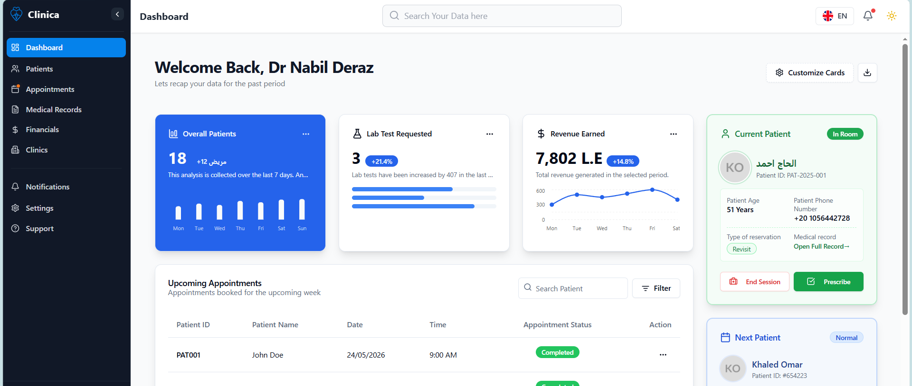

# Clinica

An Enterprise-Grade Clinic Management System That Just Works!

<p align="center">
<!-- Add your actual logo URL here -->
</img>
</p>

A feature-rich, open-source, **healthcare-focused** clinic management system built with Next.js, React, and Tailwind CSS. Designed to streamline clinic operations, patient management, and scheduling with the highest standards of data privacy.

[](#)
[-blue>)](#)
[](#)
[](#)
[](https://github.com/MohamedAbdElwahabOka/clinic-management-system-frontend)
[](https://github.com/MohamedAbdElwahabOka/clinic-management-system-frontend)

[Try the live demo (Coming Soon)](https://clinic-management-system-frontend.vercel.app/en)



## A Clinic Management System That Just Works!

- **Complete Patient Management**: Electronic Medical Records (EMR), medical history, and visit notes.
- **Smart Scheduling**: Advanced appointment booking, queue management, and doctor schedules.
- **Financial Ledger**: Income & expense tracking, service pricing, and assistant payouts.
- **Full Localization (i18n)**: Native support for English, Arabic, and German.
- **Privacy First**: Designed with HIPAA & GDPR principles in mind.
- **Responsive Design**: Fully functional on desktops, tablets, and mobile devices.
- **Fast & Modern**: Built on the Next.js App Router for optimal performance.
- **Free and Open-Source**: No subscription fees, no vendor lock-in.

### Quick Start

#### Local Development

1. **Clone the repository:**

   ```bash
   git clone https://github.com/MohamedAbdElwahabOka/clinic-management-system-frontend.git
   cd clinic-management-system-frontend
   ```

2. **Install dependencies:**

   ```bash
   npm install
   # or pnpm install / yarn install
   ```

3. **Set up environment variables:**

   ```bash
   cp .env.example .env.local
   ```

4. **Run the development server:**

   ```bash
   npm run dev
   ```

5. **Open your browser:**
   Navigate to [http://localhost:3000](http://localhost:3000) to see the application in action.

#### Build for Production

1. Build the application:

   ```bash
   npm run build
   ```

2. Start the production server:
   ```bash
   npm run start
   ```

## Documentations

Comprehensive documentation for the system architecture, features, and API integrations is currently being actively developed.

_If you are looking to contribute to the documentation, please see the [Contribution](#contribution) section._

## Updates

Keep up with the latest changes and announcements:

- Watch this repository on GitHub to receive release notifications.
- Check the [Releases](https://github.com/MohamedAbdElwahabOka/clinic-management-system-frontend/releases) page.

## Feedback

We welcome feedback from both healthcare professionals and developers!

Please start a new [issue](https://github.com/MohamedAbdElwahabOka/clinic-management-system-frontend/issues/new/choose) for bugs or feature requests.

For security reports and vulnerabilities, please reach out to the core team directly before opening public issues.

## Contribution

Contributions are welcome and highly appreciated! A huge shout-out to our wonderful contributors. Your hard work makes all the difference!

### ⚠️ Critical Rule: Healthcare Data Privacy

**Under no circumstances should you ever use, commit, post, or share real patient data (PHI/PII).** Only use fictitious data (e.g., "John Doe") when submitting bug reports, screenshots, or PRs.

Please refer to the [Contribution Guide](CONTRIBUTING.md) and our [Code of Conduct](CODE_OF_CONDUCT.md).

## Core Tech Stack

Clinica uses modern, industry-standard tools:

- [Next.js](https://nextjs.org/) (React Framework)
- [Tailwind CSS](https://tailwindcss.com/) (Styling)
- [Radix UI](https://www.radix-ui.com/) (Accessible UI Components)
- [Zustand](https://zustand-demo.pmnd.rs/) (State Management)
- [React Hook Form](https://react-hook-form.com/) & [Zod](https://zod.dev/) (Form Validation)
- [next-intl](https://next-intl-docs.vercel.app/) (Internationalization)

## License

By contributing to the Clinica project, you agree that your contributions will be licensed under its [MIT license](LICENSE).

[MIT](LICENSE) License © Mohamed AbdElwahab Oka
