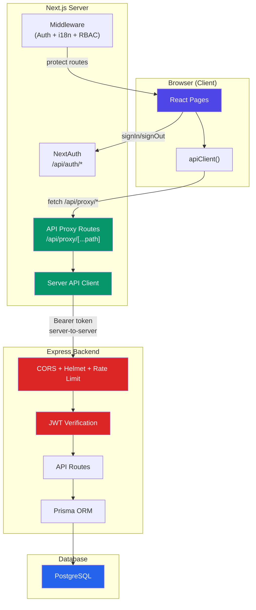

# Connecting Frontend ↔ Backend: Best Practices Implementation Plan

## Current State Analysis

After thoroughly researching both codebases, here is the reality:

| Area          | Frontend (Next.js 16)                                             | Backend (Express 5)                                                   |
| ------------- | ----------------------------------------------------------------- | --------------------------------------------------------------------- |
| **Auth**      | NextAuth v5 with Credentials — only login works                   | JWT (7-day), bcrypt, role-based                                       |
| **API Calls** | `apiClient` exists but **only login actually calls the backend**  | 9 modules with full CRUD endpoints                                    |
| **Data**      | **100% dummy data** on every page except login                    | Real Prisma/PostgreSQL data layer                                     |
| **Services**  | 2 service files exist but are **never imported by any page**      | Full service layer per module                                         |
| **Security**  | NextAuth cookie (good), DB creds in `.env` (bad)                  | Helmet, CORS, Zod — but **rate limiting is installed and never used** |
| **Types**     | Local TypeScript types with **mismatched field names and casing** | Zod DTOs + Prisma types                                               |

> [!CAUTION]
> **The frontend is currently a UI prototype.** Every single page (dashboard, patients, appointments, clinics, financials, notifications) uses hardcoded dummy data. The ONLY real API call in the entire app is the login flow through NextAuth. This means the "first step" is not a small config tweak — it's building the entire data pipeline.

---

## User Review Required

> [!IMPORTANT]
> **Architecture Decision: API Proxy (BFF) vs Direct Calls**
>
> Your frontend currently calls the backend **directly** from the browser (`http://localhost:4000/api`). This works for development but has major production problems:
>
> - Exposes your backend server address to the public
> - CORS headaches across environments
> - Can't add server-side caching, retry logic, or request batching
> - JWT tokens are sent from the browser (XSS risk)
>
> **I recommend adding Next.js API routes as a proxy layer (BFF — Backend for Frontend).** The browser only talks to Next.js, and Next.js talks to Express server-side. This is the industry standard for Next.js + external API architectures.

> [!WARNING]
> **Breaking Change: Type Contracts**
>
> Frontend and backend types are **incompatible** in many areas:
>
> - `Patient.name` → frontend: `string`, backend: `{ar: string, en: string}` (JSON)
> - `Patient.gender` → frontend: `"Male"`, backend: `"male"`
> - `Patient.contactPhone` → frontend field name vs backend's `phone`
> - `AppointmentStatus` → frontend: PascalCase, backend: UPPER_CASE
> - `VisitType` → frontend: descriptive strings, backend: `ONLINE|WALK_IN`
>
> We need to decide: adapt the frontend types to match the backend, or create a mapping/transformation layer?

---

## Open Questions

1. **Which pages should we connect first?** I recommend this priority order:
   - Login ✅ (already done)
   - Signup → `POST /api/auth/signup`
   - Add Clinic → `POST /api/clinics`
   - Dashboard (stats)
   - Patients CRUD
   - Appointments CRUD
   - Visits + Medical Records

2. **Do you want to keep the FHIR API routes?** They exist on the backend (`/fire/api/*`) but the frontend never references them.

3. **Multi-language names** — The backend stores names as `{ar: "...", en: "..."}` JSON. Does the frontend need to handle both languages for patient/clinic names, or should we simplify to a single name string?

4. **Database credentials in frontend `.env.local`** — Should I remove `DATABASE_HOST`, `DATABASE_USER`, `DATABASE_PASSWORD`, `DATABASE_NAME`, `DATABASE_PORT` from the frontend? The frontend has no direct database connection and shouldn't have these.

---

## Proposed Changes

### Phase 1: Security Hardening (Do First) 🔴

These are critical security issues that must be fixed before any production deployment.

---

#### Backend Security

##### [MODIFY] [app.ts](file:///d:/Clinic%20management%20system/clinic-management-system-backend/src/app.ts)

- **Add rate limiting** — `express-rate-limit` is already installed but never used
  - Global: 100 requests/15 min per IP
  - Login: 5 attempts/15 min per IP
  - Public booking: 10 requests/15 min per IP
- **Add compression** — `compression` is already installed but never used

##### [NEW] `src/middlewares/rate-limiter.ts`

- Separate rate limiter configurations:
  - `globalLimiter` — general protection
  - `authLimiter` — strict limits on login/signup
  - `publicApiLimiter` — protect public booking endpoints from spam

##### [MODIFY] [.env](file:///d:/Clinic%20management%20system/clinic-management-system-backend/.env)

- **Rotate the JWT secret** (it's been committed to Git history)
- Add `FRONTEND_URL=http://localhost:3000`

##### [NEW] `.env.example`

- Template with placeholder values, no real secrets

#### Frontend Security

##### [MODIFY] [.env.local](file:///d:/Clinic%20management%20system/clinic-management-system-frontend/.env.local)

- **Remove database credentials** — frontend should not have these
- Keep only: `AUTH_SECRET`, `NEXTAUTH_SECRET`, `NEXTAUTH_URL`, `NEXT_PUBLIC_BACKEND_URL`

---

### Phase 2: API Proxy Layer (BFF Pattern) 🏗️

This is the architectural foundation. Instead of the browser calling `http://localhost:4000` directly, all API calls route through Next.js server-side API routes.

```
Browser → Next.js API Route (server-side) → Express Backend
            ↑ adds auth token                    ↑ validates JWT
            ↑ handles errors                     ↑ returns data
            ↑ transforms types
```

---

##### [NEW] `src/lib/server-api-client.ts`

- **Server-side API client** for use in Next.js API routes and Server Components
- Gets the session token server-side via `auth()` (NextAuth v5)
- Adds `Authorization: Bearer` header
- Handles errors, retries, timeouts
- Type-safe with generics

##### [MODIFY] [api-client.ts](file:///d:/Clinic%20management%20system/clinic-management-system-frontend/src/lib/api-client.ts)

- Refactor to call Next.js API routes (`/api/...`) instead of the backend directly
- Remove direct `NEXT_PUBLIC_BACKEND_URL` usage from client-side code
- This way the backend URL is **never exposed to the browser**

##### [NEW] `src/app/api/proxy/[...path]/route.ts`

- Generic catch-all proxy route
- Server-side: reads NextAuth session, forwards request to Express backend with JWT
- Handles all HTTP methods (GET, POST, PUT, PATCH, DELETE)
- Transforms errors into consistent frontend-friendly format
- Adds request logging for debugging

---

### Phase 3: Type-Safe API Contract Layer 📜

Create a shared type system so frontend and backend can never go out of sync.

---

##### [NEW] `src/types/api-types.ts`

- **Canonical API types** matching the backend's Prisma/Zod schemas exactly:
  - `ApiPatient` — with `name: {ar: string, en: string}`, `gender: "male"|"female"`, `phone`
  - `ApiClinic` — with multilingual name
  - `ApiAppointment` — with UPPER_CASE status
  - `ApiVisit`, `ApiMedicalRecord`, `ApiDoctorSettings`
  - Request DTOs: `CreatePatientDto`, `UpdatePatientDto`, `CreateAppointmentDto`, etc.
  - Response wrappers: `ApiResponse<T>`, `PaginatedResponse<T>`

##### [NEW] `src/lib/type-mappers.ts`

- **Transform functions** between API types and frontend display types:
  - `mapApiPatientToPatient(apiPatient)` → frontend-friendly Patient
  - `mapPatientToApiPatient(patient)` → backend-compatible format
  - Handle: multilingual names, case conversion, field renaming
- This isolates the backend contract from UI concerns

---

### Phase 4: Service Layer (Connect Every Page) 🔌

Rebuild the service layer to actually call the API through the proxy, and wire every page to real data.

---

##### [MODIFY] [appointments.service.ts](file:///d:/Clinic%20management%20system/clinic-management-system-frontend/src/services/appointments.service.ts)

- Fix all incorrect endpoint URLs:
  - `create()` → `POST /api/clinics/:clinicId/appointments/online` (not `POST /appointments`)
  - `cancel()` → `POST /api/appointments/:id/cancel` (not `DELETE`)
  - `getQueue()` → `GET /api/clinics/:clinicId/appointments/queue` (not `GET /queue`)
- Add proper TypeScript types for request/response
- Use type mappers for data transformation

##### [MODIFY] [patients.service.ts](file:///d:/Clinic%20management%20system/clinic-management-system-frontend/src/services/patients.service.ts)

- Update to use correct API types
- Add type mapping for multilingual names

##### [NEW] `src/services/auth.service.ts`

- `signup(data)` → `POST /api/auth/signup`
- `changePassword(data)` → `POST /api/auth/change-password`
- `updateProfile(data)` → `PUT /api/auth/update-profile`

##### [NEW] `src/services/clinics.service.ts`

- Full CRUD: `getAll()`, `getById()`, `create()`, `update()`, `delete()`
- Assistant management: `addAssistant()`, `removeAssistant()`

##### [NEW] `src/services/visits.service.ts`

- `create(clinicId, data)` → `POST /api/clinics/:clinicId/visits`
- `getByClinic(clinicId)` → `GET /api/clinics/:clinicId/visits`

##### [NEW] `src/services/medical-records.service.ts`

- `create(visitId, data)` → `POST /api/medical-records/:visitId`

##### [NEW] `src/services/doctor-settings.service.ts`

- Settings and schedule CRUD

---

### Phase 5: Wire Pages to Real Data 🔄

Replace all dummy data imports with real service calls. This is the largest phase.

---

##### [MODIFY] Signup page (`src/app/[locale]/(publicAuthRoutes)/signup/SignupClient.tsx`)

- Replace `console.log` with `authService.signup(data)`
- Handle errors and show validation messages

##### [MODIFY] Add Clinic page (`src/app/[locale]/(publicAuthRoutes)/add-clinic/page.tsx`)

- Replace `alert(JSON.stringify(data))` with `clinicsService.create(data)`

##### [MODIFY] Dashboard (`src/app/[locale]/(app)/dashboard/`)

- Replace hardcoded stats with real API calls
- Use React Server Components where possible for initial data fetch

##### [MODIFY] Patients pages (`src/app/[locale]/(app)/patients/`)

- Replace `dummyPatients` with `patientsService.getAll()`
- Wire create/update forms to real API

##### [MODIFY] Appointments pages (`src/app/[locale]/(app)/appointments/`)

- Replace `initialAppointments` with `appointmentsService.getAll()`
- Wire status updates, creation, cancellation

##### [MODIFY] Clinics pages (`src/app/[locale]/(app)/clinics/`)

- Replace `dummyClinics` with `clinicsService.getAll()`

##### [MODIFY] Reception pages (`src/app/[locale]/(app)/reception/`)

- Wire appointment queue, patient check-in, walk-in flow

---

### Phase 6: Error Handling & State Management 🛡️

---

##### [NEW] `src/lib/api-error.ts`

- Custom `ApiError` class with:
  - HTTP status code
  - User-friendly message
  - Validation errors (per-field, from Zod)
  - Retry-ability flag

##### [NEW] `src/hooks/use-api.ts`

- Custom React hook wrapping service calls with:
  - Loading state
  - Error state with typed errors
  - Automatic retry (configurable)
  - Optimistic updates
  - Cache invalidation

##### [NEW] `src/components/error-boundary.tsx`

- Global error boundary for unhandled API errors
- Shows user-friendly error UI with retry option

##### [NEW] `src/stores/` (Zustand stores if needed)

- Consider adding global state for:
  - Current clinic context
  - User preferences
  - Notification count

---

### Phase 7: Production Readiness 🚀

---

#### Backend Production Config

##### [MODIFY] [app.ts](file:///d:/Clinic%20management%20system/clinic-management-system-backend/src/app.ts)

- Environment-aware CORS (multiple origins for staging/production)
- Remove `'unsafe-inline'` from CSP in production
- Add request ID middleware for tracing
- Add graceful shutdown handler

##### [NEW] `src/middlewares/request-id.ts`

- Generate UUID per request for logging/tracing across services

##### [NEW] `src/middlewares/error-handler.ts`

- Centralized error handler middleware (currently errors are handled per-controller)
- Sanitize error messages in production
- Log full errors server-side, return safe messages to client

#### Frontend Production Config

##### [MODIFY] [next.config.ts](file:///d:/Clinic%20management%20system/clinic-management-system-frontend/next.config.ts)

- Add `BACKEND_URL` (server-side only, no `NEXT_PUBLIC_` prefix) for the proxy layer
- Remove `ignoreBuildErrors: true` for TypeScript — fix real type errors instead
- Add security headers

##### [NEW] `.env.production`

- Production environment variables template
- `BACKEND_URL` (internal network address, not public)
- `NEXTAUTH_URL` (public domain)

---

## Architecture Diagram



**Key insight**: The browser **never** talks to Express directly. All traffic flows through Next.js, which acts as a secure gateway.

---

## Verification Plan

### Automated Tests

1. **Backend rate limiting**: Run `node brute_force_test.js` (already exists) — should now return 429 after 5 attempts
2. **API proxy**: `curl http://localhost:3000/api/proxy/clinics` — should forward to backend and return data
3. **Auth flow**: Login → verify session contains `accessToken` → make authenticated API call → verify data returns
4. **Type safety**: `pnpm build` on frontend should pass with no TypeScript errors (after removing `ignoreBuildErrors`)

### Manual Verification

1. **Signup flow**: Register new user → should appear in database
2. **Dashboard**: Login → dashboard should show real clinic data instead of dummy data
3. **Patients**: Create, read, update a patient → verify in database
4. **Appointments**: Book appointment → verify in database and queue view
5. **CORS**: Open browser DevTools Network tab → verify no CORS errors, no direct calls to `:4000`

---

## Recommended Execution Order

| Priority | Phase                   | Effort     | Why First?                           |
| -------- | ----------------------- | ---------- | ------------------------------------ |
| 🔴 P0    | Phase 1: Security       | 2-3 hours  | Never deploy without rate limiting   |
| 🔴 P0    | Phase 2: API Proxy      | 3-4 hours  | Foundation for everything else       |
| 🟠 P1    | Phase 3: Type Contract  | 2-3 hours  | Prevents bugs in all subsequent work |
| 🟠 P1    | Phase 4: Service Layer  | 3-4 hours  | The actual "plumbing"                |
| 🟡 P2    | Phase 5: Wire Pages     | 6-10 hours | Largest effort, page by page         |
| 🟡 P2    | Phase 6: Error Handling | 2-3 hours  | Polish and resilience                |
| 🟢 P3    | Phase 7: Production     | 2-3 hours  | Final hardening before deploy        |
